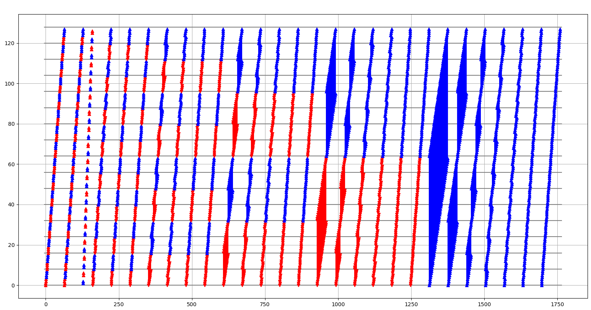

# Permuted sorting networks.
## Terminology
We use similar notation as in Knuth's Art of Computer Programming Vol. 3 [1], we let $[i:j]$ stand for a min-max comparator. A comparator network with $n$ inputs and $r$ comparators is written $[i_1:j_1][i_2:j_2]\dots[i_r:j_r]$. If $x$ is an array of $n$ elements $(x_0, x_1, \dots, x_{n-1})$ and $\alpha$ is an $n$-network, we write $x\alpha$ for the array of elements $(x_0\alpha, x_1\alpha, \dots, x_{n-1}\alpha)$ produced by the network. We say $\alpha$ is a *sorting network* if for all $0 \leq i < n-1$, we have $(x\alpha)_i \leq (x\alpha)_{i+1}$. 

Knuth defines a 'standard' sorting network to have every comparator $[i:j]$ satisfying $i < j$. We remove the ordering and simply state that $[i:j]$ places the larger value in $j$ and smaller value in $i$. These 'non-standard' comparator networks can always be converted back to standard ones [1, Ex. 5.3.4.16]. From an implementation persepective, this loosening is very useful.

Given a permutation $\pi$ on $n$ elements and array $x$ on $n$ elements, the array $x \triangleleft \pi$ represents permuting the indices of $x$ by $\pi$: for all $0\leq i < n$, $(x \triangleleft \pi)_i = x_{\pi(i)}$.

We are interested in permuting the wires of comparator networks. Given an $n$-network $\alpha = [i_1:j_1][i_2:j_2]\dots[i_r:j_r]$, a permutation $\pi$ in the symmetric group on $n$ elements acts on $\alpha$ by permuting its wires, i.e., $\alpha\pi = [\pi(i_1):\pi(j_1)][\pi(i_2):\pi(j_2)]\dots[\pi(i_r):\pi(j_r)]$. 

We discuss in the paper and verify in Lean that: If one permutes the wires of a sorting network by a permutation $\pi$, then the composition of this permuted sorting network and subsequently permuting by $\pi$ correctly sorts all input data. Using the notation above, this translates to:

Let $\alpha$ is a comparator network on $n$ elements, $x$ be an array of $n$ elements, and $\pi$ be a permutation on $n$ elements. If $\alpha$ is a sorting network, then for all $0 \leq i < n-1$, $((x(\alpha\pi)) \triangleleft \pi)_i \leq ((x(\alpha\pi)) \triangleleft \pi)_{i+1}$.

## djbsort.
### Bernstein's description
Bernstein describes djbsort version 20180729 onwards as follows [2]:

"""Internally, the sorting algorithm is now mostly bitonic to simplify indexing, although odd-even speedups are still applied when convenient. Lanes are complemented to take the down-up decision out of the inner loops.

As in previous djbsort versions, data is sorted first in vector lanes and then transposed for final merges, reducing the overall number of vector permutations. Unlike previous versions, transposition is done in-place. The transposition in this version is bit-reversal on the outer 6 bits (bottom 3 bits and the top 3 bits), but leaves intermediate bits alone. Non-power-of-2 array sizes are handled by an extra, more traditional, merge step. """

### Visualisation
The power-of-two cases in djbsort are handled by the function `int32_sort_2power`. It applies the following comparators in order from left to right:

Comparators marked in red place their maximum at their lower index, comparators in blue place their maximum at their upper index. After these comparators have been applied, he permutes and stores the array. When you apply the outer-6-bit-reversal transposition to these comparators (and undo the depth-first ordering), you obtain the following:
 
which is simply bitonic sort.

### Why bother
The majority of comparators in the bitonic sorting network are between indices of distance $1$, $2$, and $4$ apart. These require many swizzle instructions which slows performance and results in complex code with many special cases - see `docs/interlaced_sorting_networks.md`. 

For djbsort on $2^m$ elements, the permutation used by djbsort maps every comparator of length $1$ to a comparator of length $2^{m-1}$, every comparator of length $2$ to a comparator of length $2^{m-2}$, every comparator of length $4$ to a comparator of length $2^{m-3}$. We count comparator lengths for djbsort on an array of $2^9$ elements below, followed by the number of comparators of bitonic without the transposition applied.
```
      comparator    | num comparators in | num comparators in 
       index gap    | djbsort with gap   | bitonic with gap 
                    |       size         |       size
    ----------------+--------------------+----------------------
           1        |       256          |       2176        
           2        |       512          |       2048        
           4        |       768          |       1792        
           8        |      1536          |       1536        
          16        |      1280          |       1280        
          32        |      1024          |       1024        
          64        |      1792          |        768        
         128        |      2176          |        512    
         256        |      2048          |        256        
```
We see that djbsort has only $(256+512+768) / 11392 = 11\%$ of its comparators requiring swizzles, whereas the original bitonic has nearly $53\%$ of its comparators requiring swizzles.

The table also shows that the mapping doesn't change the amount of comparators of medium lengths.


### How does this extend to interlaced sorting networks?
Interlaced sorting networks remove smaller comparators as $w$ rises. If the value of $w=1$ we do not need to apply any comparators with index distance less than $2$. Unfortunately, the speed up of djbsort exists precisely because it maps those small comparators to large ones. Therefore, applying djbsort in our interlaced context results in speed decreases (see Table 2 in the paper.)

We can easily extend the ideas of djbsort to our cases. Our $w=1$ interlaced network has no comparators of length $1$, thus our map should only send comparators of length $2$ to comparators of length $2^{m-1}$ and comparators of length $4$ to comparators of length $2^{m-2}$. Similarly, for $w=2$, the only small comparators are of length $4$, thus we map these to comparators of length $2^{m-1}$. We follow exactly the same depth-first approach as discussed in `docs/interlaced_sorting_networks.md`.

We use `djbsort` itself for the $w=0$ case. For the $w=1, 2$ cases, see `src/sorting/avx/permsorts/iperm_w{1,2}`. For the cases $w \geq 3$, we simply reuse the `ibitonic` code. Note that `ibitonic` was designed to remain as faithful to the bitonic sorting network as possible to provide a good reference point for comparisons in the paper. There are speedups that could be done here, such as using optimal sorting networks in the base cases.

[1] https://dl.acm.org/doi/book/10.5555/280635
[2] https://sorting.cr.yp.to/changes.html